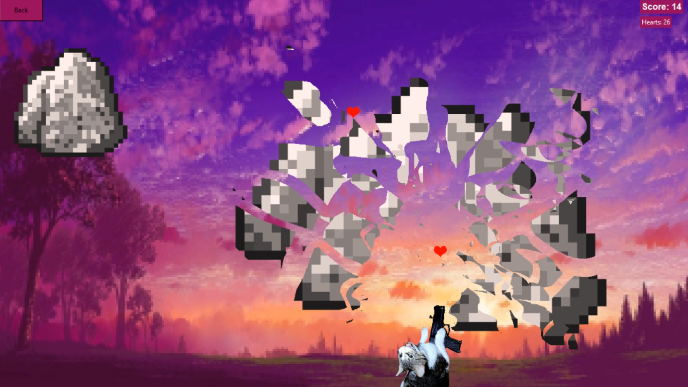

#  🐱 The Cat Game 🐱

A dynamic arcade game built with Python and Tkinter. Help the cat defend itself by shooting hearts at falling stones!





## Gameplay
* **Objective:** Shoot falling stones with hearts to survive and earn points.
* **Controls:**
    * `Left / Right Arrows` - Move the cat.
    * `Space` - Shoot hearts.
    * `Esc` - Return to the main menu.
* **Difficulty:** The game speeds up gradually as you play.
* **Game Over:** If a stone hits the cat or gets too low, the game ends.


## Features
* **Custom Engine:** Built from scratch using Python's `tkinter`.
* **Standalone Executable:** Packed into a single `.exe` file (textures included).
* **Animations:** Custom pixel-art explosions.
* **Physics:** Collision detection system.


## Tech Stack
* Python 3.10+
* Tkinter

## How to Play

### Option 1: The easiest way (WINDOWS ONLY)
You don't need Python installed.
1. Download **`CatGame.exe`** from this repository.
2. Double-click to run.
3. Enjoy!

*(Note: Windows might warn you about an "Unknown Publisher". Click "More Info" -> "Run Anyway". This is normal for indie games).*

### Option 2: Run from Source Code
( Works only with installed [Python](https://www.python.org/downloads/) ) 
1. Clone the repository:
   ```bash
   git clone https://github.com/dIMONSTERIb/TheCatGame.git
   
   cd TheCatGame
   ```
2. Run the script:
   ```bash
   python CatGame.py
   ```
---   
### Project Structure
 - `CatGame_V1.exe` - Ready-to-play game file
 - `CatGame.py` - Source code
 - `textures/` - Game assets (images, icons)
